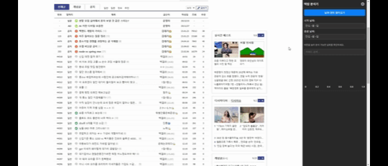
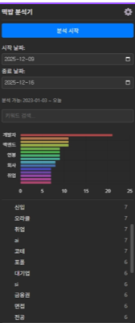
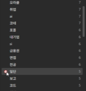
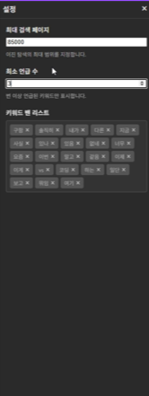

# DC 떡밥 분석기 (DCInside Topic Analyzer)

DCInside 갤러리의 특정 기간 내 게시글을 수집하고, 핵심 토픽(떡밥)을 분석하여 시각화하는 Chrome 확장 프로그램임.

 

## 🚀 개발 동기 (Motivation)

**Before (문제점)**
DCInside 갤러리에서 특정 주제나 유행하는 '떡밥'을 파악하기 위해 수많은 페이지를 일일이 넘겨보며 게시글을 확인해야 했음. 이는 시간 소모가 크고, 어떤 주제가 얼마나 자주 언급되는지 정량적으로 파악하기 어렵다는 불편함이 있었음. 특히 특정 기간 동안의 트렌드를 알고 싶을 때에는 더욱 비효율적이었음.

**After (개선점)**
'DC 떡밥 분석기'를 통해 이러한 불편함을 해소함. 이제 사용자는 특정 갤러리에서 원하는 기간을 설정하기만 하면, 확장 프로그램이 해당 기간의 모든 게시글을 자동으로 수집하고 제목을 분석하여 어떤 '떡밥'이 가장 많이 언급되었는지 시각적인 차트로 한눈에 보여줌. 이는 커뮤니티의 흐름을 빠르고 정확하게 이해하는 데 큰 도움을 줌.

 

## 📸 시연 영상 및 사진 (Demo)

**1. 갤러리 정보 초기화**

**2. 분석 실행**

**3. 게시글 검색 및 이동**

**4. 사용자 편의 기능**

 

## ✨ 주요 기능 (Features)

-   **기간 설정 분석**: 사용자가 지정한 시작일과 종료일 사이의 모든 게시글을 분석함.
-   **효율적인 데이터 수집**: 이진 탐색 알고리즘을 사용해 분석이 필요한 페이지 범위를 신속하게 찾아냄.
-   **서버 부하 최소화**: 동시 요청(Concurrency) 제한과 요청 사이의 지연(Delay)을 통해 DCInside 서버에 과도한 부하를 주지 않도록 설계됨.
-   **토픽 분석 및 시각화**: 수집된 게시글 제목에서 키워드를 추출하고, 빈도수를 계산하여 어떤 주제가 많이 언급되었는지 차트로 보여줌.
-   **키워드 기반 게시글 필터링**: 분석 결과 차트에서 특정 키워드를 클릭하면, 해당 키워드가 포함된 게시글 목록만 필터링하여 보여줌.
-   **분석 제외 키워드 설정**: 설정에서 원하지 않는 키워드를 분석에서 영구적으로 제외하는 기능을 제공함.
-   **간편한 UI**: 웹 페이지에 사이드바 형태로 자연스럽게 통합되어 손쉽게 사용 가능함.

 

## 📐 아키텍처 (Architecture)

1.  **사용자**: 확장 프로그램 아이콘을 클릭하여 사이드바를 엶.
2.  **`background.js`**: 아이콘 클릭을 감지하고, 현재 페이지가 DCInside 갤러리인지 확인한 후 `content.js`를 주입함.
3.  **`content.js`**: 페이지에 사이드바(`sidebar.html`)를 생성하고, 사이드바의 요청에 따라 게시글 데이터 수집 및 분석을 수행함.
    -   **갤러리 정보 탐색**: 이진 탐색으로 갤러리의 전체 페이지 수와 가장 오래된 게시글 날짜를 파악함.
    -   **게시글 스크래핑**: 사용자가 선택한 기간에 해당하는 페이지 범위를 다시 이진 탐색으로 정밀하게 계산한 후, 해당 페이지들의 게시글 제목과 날짜를 수집함.
4.  **`sidebar.js`**: 사용자로부터 날짜 입력을 받고, `content.js`에 분석을 요청함. `content.js`로부터 받은 결과를 `Chart.js`를 이용해 시각화하여 보여줌.

 

## 💡 설계 고려사항 및 결정 (Design Considerations & Decisions)

이 프로젝트는 **'간단함'**과 **'빠름'**을 핵심 가치로 삼고 개발을 진행함.

*   **플랫폼 선택**: 복잡한 설치 과정이 필요한 실행 프로그램 대신, 누구나 쉽게 접근하고 사용할 수 있는 **Chrome 확장 프로그램**을 개발 플랫폼으로 채택함. 이를 통해 사용자는 클릭 몇 번만으로 즉시 기능을 사용할 수 있음.

*   **기술적 제약과 선택**: 확장 프로그램 환경의 제약과 '가벼운 사용성'이라는 목표를 고려하여, 무거운 라이브러리나 외부 자연어 처리(NLP) 모델을 도입하는 대신 **자체적인 단어 필터링 방식**을 핵심 로직으로 구현함. 이는 사용자가 별도의 API 키 발급이나 비용 부담 없이 프로그램을 사용할 수 있게 함.

*   **기능적 한계와 보완**: 단순한 제목 기반 필터링 방식은 때로 부정확한 키워드를 추출할 수 있는 명백한 한계를 가짐. 이러한 기능적 아쉬움을 보완하기 위해, 사용자가 직접 **'키워드 제외(Ban) 목록'**이나 **'최대 탐색 페이지'** 등을 설정할 수 있는 커스터마이징 기능을 추가함. 이로써 프로그램의 단순함을 유지하면서도 사용자가 각자의 환경에 맞게 분석의 정확도를 높여갈 수 있도록 설계함.

 

## 🛠️ 기술 스택 (Tech Stack)

-   **Core**: `JavaScript (ES6+)`, `HTML5`, `CSS3`
-   **Platform**: `Chrome Extension API (Manifest V3)`
-   **Libraries**: `Chart.js` (데이터 시각화)
-   **Algorithms**: Binary Search (페이지 탐색 최적화)

 

## 🤔 기술적 문제 해결 사례 (Troubleshooting)

#### 1. 대규모 데이터 스크래핑의 효율성과 안정성 확보

*   **문제**: DCInside 갤러리는 게시글 수가 방대하며, 긴 기간 설정 시 수천 페이지에 달하는 데이터를 스크래핑해야 했음. 단순히 순차적으로 모든 페이지를 요청하는 방식은 시간이 매우 오래 걸리고, 서버에 과도한 부하를 주어 IP 차단 등의 문제가 발생할 위험이 있었음.

*   **해결**:
    *   **이진 탐색(Binary Search) 도입**: 특정 날짜 범위에 해당하는 게시글의 시작과 끝 페이지를 효율적으로 찾기 위해 이진 탐색을 활용함. 이를 통해 불필요한 페이지 요청을 대폭 줄여 필요한 데이터만 스크래핑할 수 있도록 함.
    *   **동시 요청 제한 및 지연(Concurrency Control & Delay)**: `Promise.allSettled`와 함께 `CONCURRENT_LIMIT`를 두어 동시 요청 수를 제한하고, 각 배치(batch) 요청 사이에 무작위 지연을 추가하여 자연스러운 요청 흐름을 시뮬레이션하고 서버의 감지를 피하도록 함.

*   **결과**: 불필요한 트래픽을 최소화하고, 안정적으로 대량의 게시글 데이터를 수집할 수 있는 견고한 스크래핑 로직을 구현함. 이는 확장 프로그램의 사용자 경험과 서버 운영의 지속 가능성 모두를 확보하는 데 기여함.

#### 2. Chrome 확장 프로그램의 동적인 콘텐츠 주입 및 통신

*   **문제**: 확장 프로그램의 핵심 기능인 사이드바 UI를 사용자가 방문한 웹 페이지에 동적으로 주입하고, 주입된 UI와 백그라운드, 콘텐츠 스크립트 간의 유기적인 통신이 필요했음. 특히, `content.js` 주입 전에 사용자가 아이콘을 클릭하면 사이드바가 작동하지 않을 수 있는 문제가 있었음.

*   **해결**:
    *   **`background.js`의 역할**: `chrome.action.onClicked` 리스너를 활용해 아이콘 클릭 이벤트를 처리하고, `chrome.scripting.executeScript`로 필요한 시점에 `content.js`를 페이지에 주입하도록 함.
    *   **메시지 기반 통신**: `chrome.runtime.sendMessage`와 `chrome.runtime.onMessage.addListener`를 사용하여 `background.js`, `content.js`, `sidebar.js` 간에 메시지를 주고받는 방식으로 비동기 작업을 안전하게 처리함.
    *   **주입 상태 추적**: `injectedContentScripts` 맵으로 탭의 스크립트 주입 상태를 추적하고, `pendingToggleTabs`를 통해 아이콘이 먼저 클릭된 경우에도 주입 후 사이드바가 자동으로 열리도록 처리하여 사용자 경험을 개선함.

*   **결과**: Chrome 확장 프로그램 환경에서 다양한 컴포넌트 간의 복잡한 비동기 통신을 효과적으로 관리하고, 사용자 인터랙션에 따라 동적으로 콘텐츠를 주입하여 기능을 제공하는 방법을 학습하고 적용함.

#### 3. 사용자 경험(UX) 개선 및 기능 고도화

*   **문제 1: 무의미한 키워드 추출**
    *   게시글 제목에서 단어 단위로 키워드를 추출하다 보니, 'ㅋㅋ', '[잡담]' 등 분석에 의미 없는 단어들이 상위권을 차지하여 핵심 토픽 파악을 방해하는 문제가 있었음.

*   **해결 1: 키워드 제외(Ban) 기능 추가**
    *   사용자가 직접 분석 결과에서 특정 키워드를 '제외'할 수 있는 기능을 추가함. 이 제외 목록은 `chrome.storage.local`에 저장되어, 해당 사용자의 이후 모든 분석에 영구적으로 반영되도록 하여 분석의 정확도를 높임.

*   **문제 2: 갤러리별 탐색 범위 제한**
    *   갤러리마다 전체 페이지 수가 달라, 고정된 최대 탐색 페이지 수로는 일부 갤러리의 모든 게시글을 크롤링하지 못하고 중간에 멈추는 문제가 발생함.

*   **해결 2: 동적 탐색 범위 설정 기능**
    *   사용자가 설정(Settings) 탭에서 '최대 탐색 페이지' 값을 직접 조절할 수 있도록 기능을 추가함. 이를 통해 게시글이 매우 많은 갤러리에서도 모든 글을 끝까지 탐색할 수 있도록 하여 분석의 완전성을 보장함.
